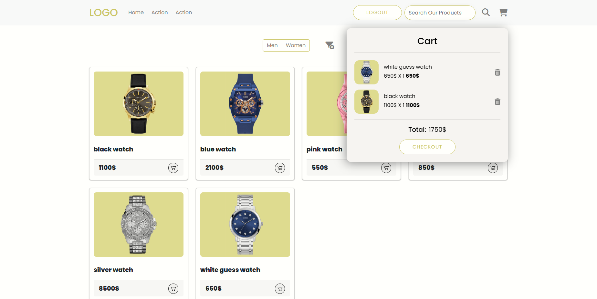
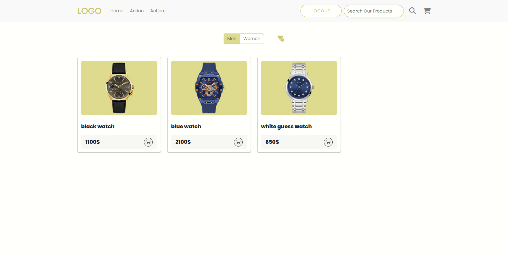
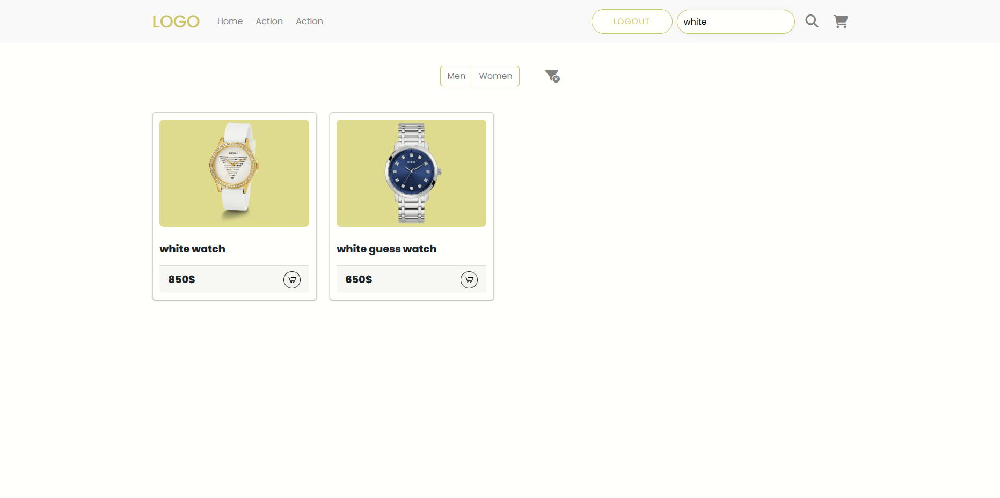
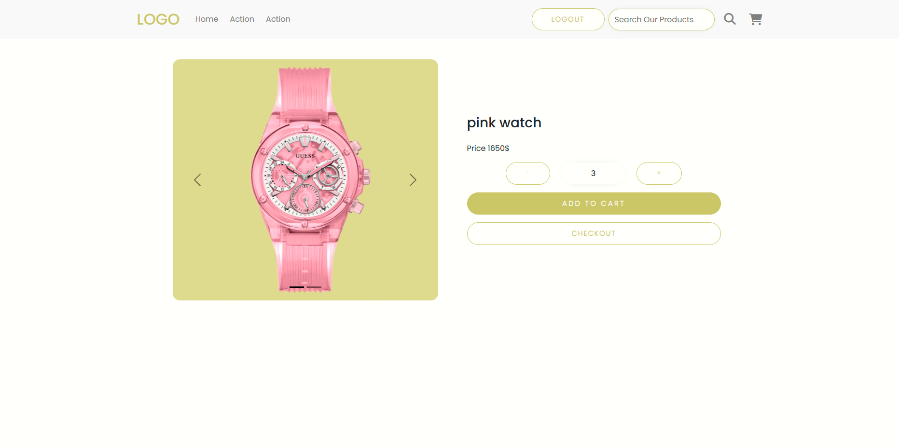
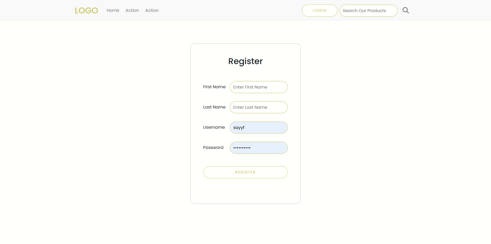
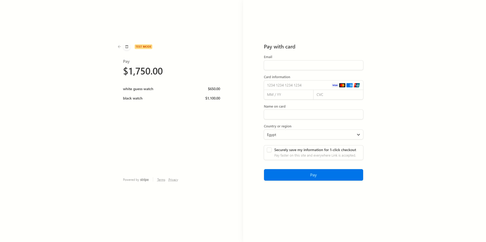

<h1 align="center">
  <br>
  
  <br>
  E-Watches
  <br>
</h1>

<h4 align="center">Full-Stack App for E-Commerce Website

<p align="center">
  <a href="#overview">Overview</a> •
  <a href="#screenshots">Screenshots</a> •
  <a href="#how-to-use">How To Use</a> •  
  <a href="#endpoints">Endpoints</a> •
  <a href="#data-shapes">Data Shapes</a> •
  <a href="#credits">Credits</a> •
</p>

<br /><br />

## Overview

<br />
This is a Full-Stack E-commerce app that specializes in selling watches, it simulates all the user experience starting from creating an account to simulating a transaction, this includes browsing products, searching and filtering products, adding and removing them from cart, and checking out your personal cart  
<br />
<br />

## Screenshots

<div align="center"> 
   <br /><br />
   <br /><br />
  <br /><br />
  <br /><br />
  <br /><br />
  <br /><br />
</div>

<br />
<br />

## How To Use

To clone and run this application, you'll need [Git](https://git-scm.com) and [Node.js](https://nodejs.org/en/download/) (which comes with [npm](http://npmjs.com)) installed on your computer. From your command line:

```bash
# Clone this repository
$ git clone https://github.com/Sayyfz/store-front-app

# Opening the backend app folder
$ cd backend

# Run the database migrations
$ db-migrate up

# Install dependencies
$ npm install

# Run the server
$ npm run start

# Run the tests
$ npm run test
```

<br />

#### **Setup database in PSQL terminal (WSL2 or VS code terminal)**

<br />

```bash
# Create user
$ CREATE USER test_user WITH PASSWORD 'Pass1234';

# Create database
$ CREATE DATABASE store_front;
$ CREATE DATABASE store_front_test;

# Run the database migrations
$ db-migrate up

# Grant all privileges
$ GRANT ALL PRIVILEGES ON DATABASE store_front TO test_user;
$ GRANT ALL PRIVILEGES ON DATABASE store_front_test TO test_user;

# Connect to database
$ psql -u <username> -p <port> -D <database_name>
```

<br />

> **Note**
> If you're using Linux Bash for Windows, [see this guide](https://www.howtogeek.com/261575/how-to-run-graphical-linux-desktop-applications-from-windows-10s-bash-shell/) or use `node` from the command prompt.

<br />

## Endpoints

<br />

#### **Users Routes**

-   **GET** /users to get all users (token required)
-   **GET** /users/:id to get a specific user using the id (token required)
-   **POST** /users to create a new user (Please check the data shapes to see what you should enter in the body)
-   **POST** /users/authenticate to authenticate a user by entering username and password
-   **PATCH** /users/:id to update user credentials
-   **DELETE** /users/:id to delete a user
    <br />
    <br />

#### **Products Routes**

-   **GET** /products to get all products
-   **GET** /products/:id to get a specific cart using the id
-   **PATCH** /products/:id to update product details
-   **POST** /products to create a new product (Check the data shapes to see what you should enter in the body)
-   **DELETE** /products/:id to delete a product
    <br />
    <br />

#### **Carts Routes**

-   **GET** /carts to get all carts
-   **GET** /carts/:id to get a specific cart using the id
-   **POST** /carts to create a new cart (Check the data shapes for more info)
-   **PATCH** /carts/:id to update cart details
-   **DELETE** /carts/:id to delete a cart
-   **POST** /carts/:id/products to add a product to a specific cart (Check the data shapes to see what you should enter in the body)
    **DELETE** /carts/:id/products/:product_id delete a specific product from a specific cart
    <br />
    <br />

#### **Categories Routes**

-   **GET** /categories to get all categories
-   **GET** /categories/:id to get a specific category using the id
-   **PATCH** /categories/:id to update category details
-   **POST** /categories to create a new category (Check the data shapes to see what you should enter in the body)
-   **DELETE** /categories/:id to delete a category
    <br />
    <br />

#### **Product Images Routes**

-   **GET** /product-images to get all product images
-   **GET** /product-images/:id to get a specific product image using the id
-   **PATCH** /product-images/:id to update product image details
-   **POST** /product-images to create a new product image (Check the data shapes to see what you should enter in the body)
-   **DELETE** /product-images/:id to delete a product image
    <br />
    <br />

#### **Checkout Route**

-   **POST** /checkout to send checkout details
    <br />
    <br />

#### **Services Routes**

-   **GET** /products_by_category/:categoryId to get products by category
-   **GET** /products_search to get products by search query
    <br />
    <br />

## Data Shapes

##### **All data shapes have an auto-generated id which we don't need to provide unless it's required in the url parameters. However, in all cases we don't need it in a request body.**

<br />

#### **User**

-   first_name: string
-   last_name: string
-   username: string
-   password: string

#### **Product**

-   name: string
-   price: number
-   category_id: string

#### **Cart**

-   user_id: number
-   total_price: number
-   order_status: string

#### **Products Inside Carts**

-   product_id: number
-   quantity: number

#### **Category**

-   name: string

#### **Product Image**

-   image_url: string (To enter an image just enter form-data instead of request body and attach an image to a field called image instead of image_url)
-   product_id: number

## Credits

This software uses the following libraries and frameworks:

-   [Node.js](https://nodejs.org/)
-   [Express.js](https://expressjs.com/)
-   [PostgreSQL](https://www.postgresql.org/)
-   [Jasmine](https://jasmine.github.io/)
-   [TypeScript](https://www.typescriptlang.org/)
-   [dotenv](https://www.npmjs.com/package/dotenv)
-   [Json Web Token](https://www.npmjs.com/package/jsonwebtoken)
-   [bcrypt](https://www.npmjs.com/package/bcrypt)
-   [db-migrate](https://www.npmjs.com/package/db-migrate)
